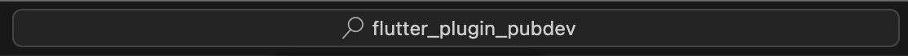
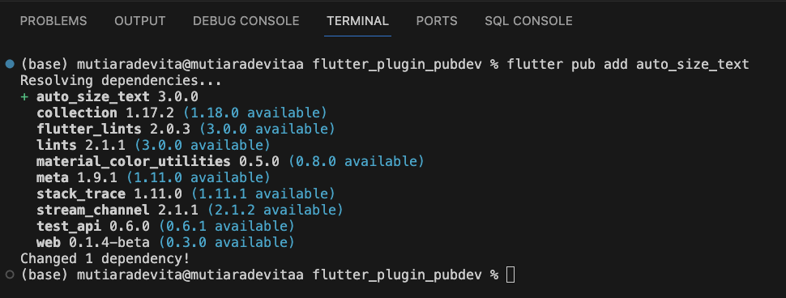
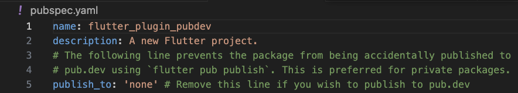
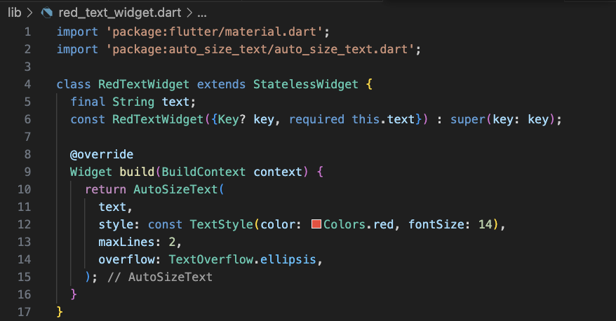
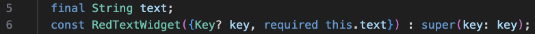
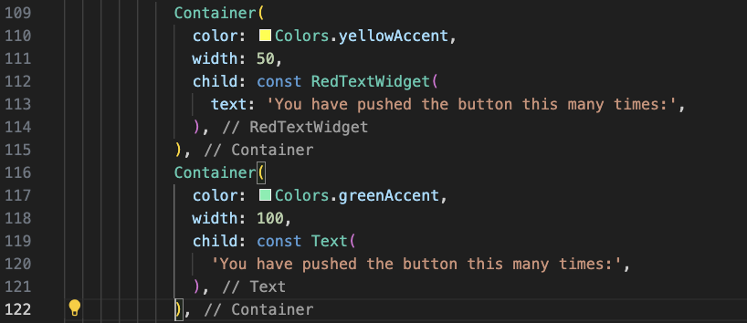
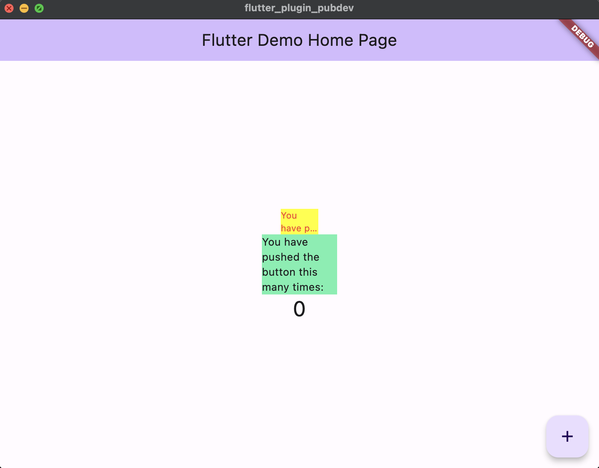

- Tugas Praktikum
1. Selesaikan Praktikum tersebut, lalu dokumentasikan dan push ke repository Anda berupa screenshot hasil pekerjaan beserta penjelasannya di file README.md!
- Langkah 1: Buat Project Baru
Buatlah sebuah project flutter baru dengan nama flutter_plugin_pubdev. Lalu jadikan repository di GitHub Anda dengan nama flutter_plugin_pubdev.

- Langkah 2: Menambahkan Plugin
Tambahkan plugin auto_size_text menggunakan perintah berikut di terminal
flutter pub add auto_size_text

Jika berhasil, maka akan tampil nama plugin beserta versinya di file pubspec.yaml pada bagian dependencies.

- Langkah 3: Buat file red_text_widget.dart
Buat file baru bernama red_text_widget.dart di dalam folder lib lalu isi kode seperti berikut.

- Langkah 4: Tambah Widget AutoSizeText
Masih di file red_text_widget.dart, untuk menggunakan plugin auto_size_text, ubahlah kode return Container() menjadi seperti berikut.

Setelah Anda menambahkan kode di atas, Anda akan mendapatkan info error. Mengapa demikian? Jelaskan dalam laporan praktikum Anda!
Penjelasan :
Pesan kesalahan pada kode diatas adalah karena kode diatas menggunakan variabel text di dalam AutoSizeText tetapi variabel tersebut tidak dideklarasikan dalam lingkup metode build.
- Langkah 5: Buat Variabel text dan parameter di constructor
Tambahkan variabel text dan parameter di constructor seperti berikut.

- Langkah 6: Tambahkan widget di main.dart
Buka file main.dart lalu tambahkan di dalam children: pada class _MyHomePageState

Run aplikasi tersebut dengan tekan F5, maka hasilnya akan seperti berikut.

2. Jelaskan maksud dari langkah 2 pada praktikum tersebut!
Penjelasan :
flutter pub add auto_size_text digunakan untuk menambahkan paket Flutter bernama auto_size_text ke dalam proyek Flutter. Paket ini menyediakan widget yang memungkinkan teks secara otomatis menyesuaikan ukuran fontnya agar cocok dalam kotak yang telah ditentukan.
3. Jelaskan maksud dari langkah 5 pada praktikum tersebut!
Penjelasan :
. Kode final String text; digunakan untuk mendeklarasi dan inisialisasi field text dalam suatu class atau objek. text adalah variabel dengan tipe data String dan diberi kata kunci final, yang berarti nilainya harus diinisialisasi saat objek atau instance dari class tersebut dibuat dan tidak dapat diubah setelahnya.
. Kode const RedTextWidget({Key? key, required this.text}) : super(key: key); adalah deklarasi constructor untuk sebuah Flutter widget bernama RedTextWidget.
- const menandakan bahwa constructor ini dapat dianggap sebagai konstanta waktu kompilasi, yang berarti hanya dapat digunakan dengan nilai yang sudah dikenal pada saat kompilasi. Ini berguna untuk mengoptimalkan kinerja dan efisiensi aplikasi Flutter.
- RedTextWidget adalah nama dari widget yang Anda definisikan.
- {Key? key, required this.text} adalah parameter-parameter yang digunakan dalam constructor ini. Parameter Key? key adalah opsional dan digunakan untuk mengidentifikasi widget secara unik. Parameter required this.text adalah parameter yang harus diisi dengan nilai teks ketikamembuat instance dari widget ini. required menandakan bahwa nilai untuk parameter text harus disediakan pada saat pembuatan widget.
- super(key: key) digunakan untuk memanggil constructor dari superclass widget ini dengan memberikan parameter key. Ini biasanya digunakan ketika widget ini adalah turunan dari widget yang ada.
4. Pada langkah 6 terdapat dua widget yang ditambahkan, jelaskan fungsi dan perbedaannya!
- Kode Pertama :
. Menggunakan widget RedTextWidget.
. Warna latar belakang Container diatur menjadi kuning dengan color: Colors.yellowAccent.
. Lebar Container diatur menjadi 50.
. Di dalam Container, Menggunakan RedTextWidget dengan teks "You have pushed the button this many times:".
- Kode Kedua :
. Menggunakan widget bawaan Flutter yaitu Text.
. Warna latar belakang Container diatur menjadi hijau dengan color: Colors.greenAccent.
. Lebar Container diatur menjadi 100.
. Di dalam Container, Menggunakan Text dengan teks yang sama, "You have pushed the button this many times:".
- Fungsi dari kode ini adalah menciptakan dua kotak atau Container yang berbeda dalam hierarki tampilan Flutter:
. Container pertama memiliki latar belakang kuning, lebar 50 piksel, dan berisi RedTextWidget, yang mungkin akan menampilkan teks dengan warna merah.
. Container kedua memiliki latar belakang hijau, lebar 100 piksel, dan berisi widget Text, yang akan menampilkan teks dengan warna default (biasanya hitam atau sesuai tema default Flutter).
5. Jelaskan maksud dari tiap parameter yang ada di dalam plugin auto_size_text berdasarkan tautan pada dokumentasi ini !
Penjelasan :
. text: Teks yang akan ditampilkan pada widget.
. style: Style teks yang akan ditampilkan pada widget.
. maxLines: Jumlah maksimal baris yang akan ditampilkan pada widget.
. overflow: Teks yang akan ditampilkan jika melebihi jumlah maksimal baris yang ditampilkan pada widget.
. minFontSize: Ukuran minimal teks yang akan ditampilkan pada widget.
. maxFontSize: Ukuran maksimal teks yang akan ditampilkan pada widget.
. stepGranularity: Ukuran langkah yang digunakan untuk mengatur ukuran teks pada widget.
. presetFontSizes: Ukuran teks yang akan ditampilkan pada widget.
. group: Group yang digunakan untuk mengatur ukuran teks pada widget.
. textAlign: Penataan teks yang akan ditampilkan pada widget.
. textDirection: Arah teks yang akan ditampilkan pada widget.
. textScaleFactor: Faktor skala teks yang akan ditampilkan pada widget.
. semanticsLabel: Label semantik yang digunakan untuk mengatur ukuran teks pada widget.
. wrapWords: Mengatur apakah teks yang akan ditampilkan pada widget akan dibungkus atau tidak.
. locale: Digunakan untuk memilih font ketika karakter Unicode yang sama dapat dirender secara berbeda, bergantung pada lokalnya.
6. Kumpulkan laporan praktikum Anda berupa link repository GitHub ke spreadsheet yang telah disediakan!
https://github.com/mutiaradevita/flutter_plugin_pubdev
